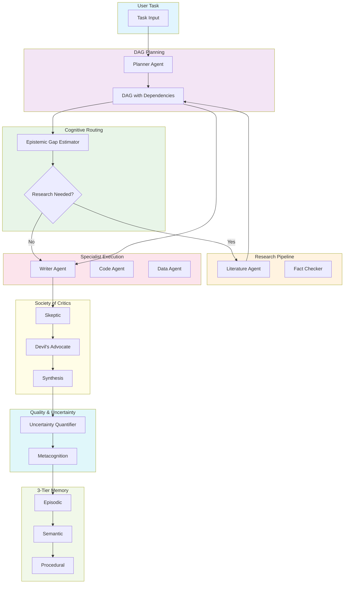

# AgentOS

> An autonomous research & execution agent system with human-like memory, self-reflection, and multi-agent debate.

## The Story

Imagine asking an AI: *"Write me a research paper on quantum computing in finance"* — and instead of a generic response, you get a system that:

1. **Plans** — Breaks your request into a dependency-aware task graph (some tasks parallel, some sequential)
2. **Thinks** — Estimates what it *doesn't know* (epistemic gap) and routes accordingly
3. **Researches** — Fetches latest papers when needed, not for everything
4. **Debates** — Three AI critics (Skeptic, Devil's Advocate, Synthesis) review the output
5. **Quantifies Uncertainty** — Ensures every answer comes with a confidence score
6. **Remembers** — Stores knowledge in 3-tier memory (episodic + semantic + procedural)
7. **Learns** — Meta-cognitively reflects on failures and adjusts its own prompts

That's **AgentOS** — an agent operating system designed for complex, multi-step knowledge work.

## Architecture



## Key Features

| Feature | What It Does |
|---------|--------------|
| **DAG Task Planning** | Breaks tasks into dependency-aware graph; parallelizes independent subtasks |
| **Cognitive Routing** | LLM-as-judge estimates epistemic gap; routes to research only when needed |
| **Pluggable Specialist Agents** | 15+ specialist agents (Writer, Debugger, DataAnalyzer, etc.) with intelligent dispatch |
| **Society of Critics** | 3-agent debate (Skeptic → Devil's Advocate → Synthesis) for quality review |
| **3-Tier Memory** | Episodic (events), Semantic (entities), Procedural (workflows) — like human memory |
| **Uncertainty Quantification** | Runs outputs 3 times, computes confidence scores using semantic variance |
| **Agent Metacognition** | Self-reviews failures, dynamically adjusts prompts over time |
| **Human-in-the-Loop** | Optional human review for critical decisions |

## How AgentOS Differs from Claude, GPT, or Existing Solutions

| Aspect | Claude/GPT (Chat Mode) | AgentOS |
|--------|----------------------|---------|
| **Task Handling** | Single prompt → single response | Breaks into DAG, executes multi-step |
| **Research** | May hallucinate stale info |主动路由 research agents when epistemic gap is high |
| **Memory** | No persistent memory | 3-tier memory with forgetting curves |
| **Quality Review** | No built-in critic | Multi-agent adversarial debate + uncertainty scoring |
| **Self-Improvement** | Static prompts | Metacognitive feedback loop adjusts prompts |
| **Planning** | Implicit, one-shot | Explicit dependency graph with parallel execution |
| **Transparency** | Black box | Full agent logs, debate transcripts, confidence scores |

> **In short**: Claude/GPT answer questions. AgentOS *executes complex tasks* with research, debate, memory, and self-reflection — like a team of specialists working together.

## Tech Stack

| Layer | Technology | 1-Line Explanation |
|-------|------------|-------------------|
| **Orchestration** | LangGraph | Graph-based agent workflow with state management |
| **LLM** | Google Gemini | Foundational model for reasoning & generation |
| **Vector Memory** | ChromaDB | Semantic search over stored knowledge |
| **Database** | SQLite | Task metadata & session persistence |
| **Backend API** | FastAPI | High-performance async Python web server |
| **Frontend** | React + Vite | Modern SPA with hot module replacement |
| **State** | TanStack Query | Server state synchronization & caching |
| **Animations** | Framer Motion | Smooth UI transitions |
| **Icons** | Lucide | Lightweight icon set |

## What AgentOS Does

- **Accepts complex tasks** — like "research + write + cite" workflows
- **Decomposes into DAG** — dependency-aware task graph with parallel execution
- **Intelligently routes** — estimates what it knows vs. needs to research
- **Executes specialists** — dispatches to 15+ specialist agents based on task type
- **Debates quality** — Skeptic/Devil's Advocate/Synthesis review output
- **Scores confidence** — uncertainty quantification for every output
- **Stores in memory** — 3-tier (episodic/semantic/procedural) with forgetting curves
- **Learns from failures** — metacognition adjusts prompts over time
- **Optional human review** — critical decisions can pause for human approval

---

## Quick Start

### Prerequisites
- Python 3.10+
- Node.js 18+
- Google Gemini API key

### Backend Setup

```bash
cd agentOS-backend
pip install -r requirements.txt
echo "GEMINI_API_KEY=your_api_key_here" > .env
uvicorn main:app --reload --port 8000
```

### Frontend Setup

```bash
cd agentos
npm install
npm run dev
```

**Dashboard**: `http://localhost:5173`

## API Endpoints

| Endpoint | Method | Description |
|----------|--------|-------------|
| `/api/task` | POST | Submit new task |
| `/api/task/{id}/status` | GET | Get task status & logs |
| `/api/task/{id}/approve` | POST | Approve/reject review |
| `/api/task` | GET | List all tasks |
| `/api/memory/search?q=` | GET | Semantic memory search |
| `/api/memory/count` | GET | Memory entry count |

## Project Structure

```
agentOS-backend/
├── agents/           # Specialist agents (Writer, Debugger, Research...)
├── core/             # LangGraph workflow orchestration
├── memory/           # ChromaDB + 3-tier memory
└── api/              # FastAPI routes

agentos/              # React frontend
├── src/components/   # UI components
├── src/pages/        # Dashboard, TaskView, Memory
└── src/hooks/        # Custom React hooks
```

## Agent Registry

| Category | Agents |
|----------|--------|
| **Content** | Writer, Editor, Summarizer |
| **Code** | CodeGen, Debugger, TestGen, CodeReview |
| **Research** | Literature, Citation, FactChecker |
| **Data** | DataAnalyzer, Visualizer, DataCleaner |
| **Document** | DocGenerator, SlideGenerator |

## Contributing

1. Fork → Branch → Commit → Push → PR

## License

MIT — see [LICENSE](LICENSE)

## Built With

- [LangGraph](https://github.com/langchain-ai/langgraph) — Agent orchestration
- [Google Gemini](https://ai.google.dev/) — LLM backbone
- [ChromaDB](https://www.trychroma.com/) — Vector memory
- [FastAPI](https://fastapi.tiangolo.com/) — Backend API
