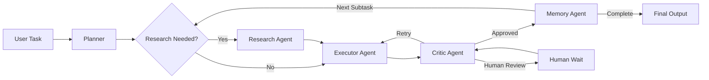
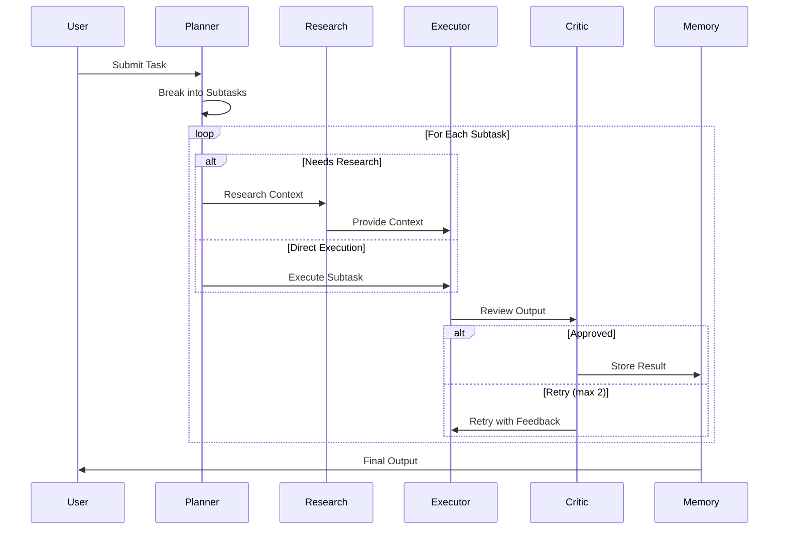

# AgentOS

A multi-agent orchestration system that breaks down complex tasks into subtasks and executes them through specialized AI agents with memory persistence and quality control.

## Architecture



## Agent Workflow



## Features

- **Multi-Agent System**: Specialized agents for planning, research, execution, and quality control
- **Intelligent Routing**: Automatic research detection for knowledge-intensive subtasks
- **Quality Assurance**: Built-in critic agent with retry logic and optional human review
- **Memory Persistence**: ChromaDB-powered semantic memory for context retrieval
- **Real-time Updates**: Live agent status tracking via REST API
- **Modern UI**: React-based dashboard with task monitoring and memory exploration

## Tech Stack

**Backend**
- FastAPI (Python)
- LangGraph for agent orchestration
- ChromaDB for vector memory
- SQLite for task persistence
- Google Gemini for LLM

**Frontend**
- React + Vite
- TanStack Query for state management
- Framer Motion for animations
- Lucide icons

## Quick Start

### Prerequisites
- Python 3.10+
- Node.js 18+
- Google Gemini API key

### Backend Setup

```bash
cd agentOS-backend
pip install -r requirements.txt

# Create .env file
echo "GEMINI_API_KEY=your_api_key_here" > .env

# Start server
uvicorn main:app --reload --port 8000
```

### Frontend Setup

```bash
cd agentos
npm install
npm run dev
```

Access the dashboard at `http://localhost:5173`

## API Endpoints

| Endpoint | Method | Description |
|----------|--------|-------------|
| `/api/task` | POST | Submit new task |
| `/api/task/{id}/status` | GET | Get task status & agent logs |
| `/api/task/{id}/approve` | POST | Approve/reject human review |
| `/api/task` | GET | List all tasks |
| `/api/memory/search?q=` | GET | Search memory |
| `/api/memory/count` | GET | Memory entry count |

## Project Structure

```
.
├── agentOS-backend/
│   ├── agents/          # Agent implementations
│   ├── api/             # FastAPI routes & models
│   ├── core/            # LangGraph workflow & LLM
│   ├── db/              # Database models & connection
│   └── memory/          # ChromaDB integration
│
└── agentos/
    ├── src/
    │   ├── components/  # React components
    │   ├── pages/       # Dashboard, TaskView, Memory
    │   ├── hooks/       # Custom React hooks
    │   └── lib/         # API client
    └── public/
```

## Configuration

### Environment Variables

**Backend** (`.env`)
```env
GEMINI_API_KEY=your_key_here
DATABASE_URL=sqlite:///./agentOS.db
CHROMA_PERSIST_DIR=./chroma_db
```

**Frontend** (`src/lib/api.js`)
```javascript
baseURL: 'http://localhost:8000'
```

## Agent Details

| Agent | Purpose | Triggers |
|-------|---------|----------|
| **Planner** | Breaks task into subtasks | Always first |
| **Research** | Gathers context from web/memory | Keywords: find, search, research, latest, current |
| **Executor** | Executes subtask with context | Every subtask |
| **Critic** | Reviews output quality | After execution |
| **Memory** | Stores results in ChromaDB | After approval |

## Contributing

1. Fork the repository
2. Create a feature branch (`git checkout -b feature/amazing-feature`)
3. Commit changes (`git commit -m 'Add amazing feature'`)
4. Push to branch (`git push origin feature/amazing-feature`)
5. Open a Pull Request

## License

MIT License - see [LICENSE](LICENSE) file for details

## Acknowledgments

- Built with [LangGraph](https://github.com/langchain-ai/langgraph)
- Powered by [Google Gemini](https://ai.google.dev/)
- Vector storage by [ChromaDB](https://www.trychroma.com/)
