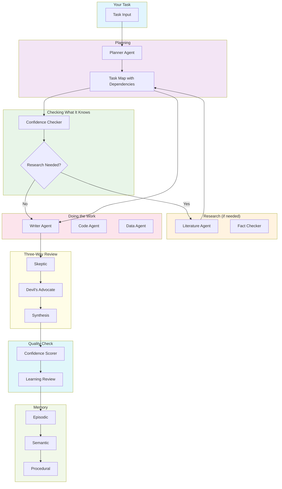

# AgentOS

> An autonomous research & execution agent system with human-like memory, self-reflection, and multi-agent debate.

---

## Project Overview

**"What would it take for an AI to work like a research team, not just answer questions?"**

That's the question AgentOS answers.

**AgentOS is an AI agent system that doesn't just give you answers — it executes complex, multi-step tasks the way a human research team would:** planning, researching, drafting, debating, and refining its work. It knows what it doesn't know, brings in specialists when needed, challenges its own output through debate, and tells you how confident it is in each result.

*(If you're new to AI terms: an **agent** is just a program that can decide and act on its own, rather than just following fixed instructions. An **LLM** (Large Language Model) is the underlying AI — like ChatGPT or Claude — that understands and generates text.)*

### Why It's Special

Regular AI assistants are simple Q&A tools. You ask, they answer — done. AgentOS treats your request as a **project**, not a question. It breaks big tasks into smaller pieces that can run in parallel, researches facts when unsure, brings in specialized experts (writer, coder, data analyst), runs three-way reviews of its own work, and gets better over time.

### What It Does

1. **Plans** — Breaks your request into a task map with pieces that can run simultaneously
2. **Thinks** — Checks if it knows something reliably or needs to research it
3. **Debates** — Three AI reviewers (Skeptic, Devil's Advocate, Synthesis) improve every output
4. **Scores confidence** — Tells you how sure it is — so you know what to trust
5. **Remembers** — Three types of memory (events, facts, workflows) that persist across sessions
6. **Learns** — Reviews failures and improves how it handles future tasks

### How It's Different

| Regular ChatGPT/Claude | AgentOS |
|------------------------|---------|
| Ask → single answer | Task → multi-step execution with planning |
| May make up facts | Looks up facts when it doesn't know |
| Forgets everything after each chat | Remembers past sessions |
| No self-check | Three-way debate + confidence scores |
| Same approach every time | Gets better from experience |

**In one sentence:** AgentOS is an autonomous research team in software — it plans, researches, debates, and learns, rather than just answering questions.

---

## The Problem AgentOS Solves

When you ask ChatGPT or Claude a complex question like *"Write me a research paper on quantum computing in finance"*, here's what typically happens:

1. **They guess** — Using knowledge from training data, possibly outdated by months or years
2. **They may make up facts** — (In AI terms, this is called "hallucination" — confidently stating false information as if it's true)
3. **They stop** — They produce one response and consider the task done
4. **They forget** — Next time you ask a similar question, they start from scratch
5. **They don't self-check** — No built-in critique or quality review of their own output

**AgentOS** is different. It's built for *complex, multi-step knowledge work* — not just answering questions, but actually executing tasks that require research, drafting, revision, and verification.

## What AgentOS Actually Does (Plain English)

Think of AgentOS as **a team of AI specialists working together** on your task:

| What Happens | Why It Matters |
|--------------|----------------|
| **1. Plans the work** | Breaks your request into smaller tasks that can be done in parallel or sequence |
| **2. Thinks about what it knows** | Estimates whether it needs to research or can proceed from existing knowledge |
| **3. Researches when needed** | Goes out and fetches actual papers, data, or facts — not guessing |
| **4. Gets specialist help** | Routes to the right "expert" (writer, coder, data analyst, etc.) |
| **5. Reviews its own work** | Three AI critics debate and improve the output |
| **6. Shows confidence** | Tells you how sure it is — not everything is equally reliable |
| **7. Remembers for later** | Stores what it learned so future tasks are faster |
| **8. Learns from mistakes** | Meta-cognition reviews failures and adjusts its approach |

---

## Understanding Each Feature

### 1. Task Planning — "How to Eat an Elephant"

**The Problem**: When you give AgentOS a big task, how does it know what to do first?

**The Solution**: Think of it like cooking. You can't sauté onions before chopping them. AgentOS figures out which tasks must happen first, then runs independent tasks at the same time (like cooking side dishes while the main dish simmers).

*(Technical note: this is called a "DAG" or Directed Acyclic Graph — just a fancy term for a to-do list where arrows show what must finish before what starts.)*

**Why it matters**: Without this, every task runs one after another, wasting time. With smart planning, pieces that don't depend on each other run together.

### 2. Smart Routing — "Know What You Don't Know"

**The Problem**: AI models learn from a fixed set of data (their "training"). They don't know about events that happened after that, and they don't always know when they're guessing.

**The Solution**: AgentOS asks itself: *"How confident am I about this? Do I need to look it up?"* If it feels uncertain, it routes to research agents to fetch fresh information. If it already knows the topic well, it skips research and just answers.

*(This idea is called "epistemic gap" — it's just a fancy way of saying "the gap between what you know and what you need to know.")*

**Why it matters**: This prevents the AI from making up facts by only researching when genuinely needed, not always and not never.

### 3. Specialist Agents — "The Right Tool for the Job"

**The Problem**: A general-purpose AI can't be equally good at writing, coding, data analysis, and research all at once.

**The Solution**: AgentOS has 15+ specialized agents, each focused on one type of work:

- **Writer** — Drafts papers, reports, articles
- **CodeGen** Writes code from descriptions
- **Debugger** Finds and fixes bugs in code
- **DataAnalyzer** Analyzes datasets, finds patterns
- **Literature** Searches academic papers
- **FactChecker** Verifies if claims are true

When you submit a task, AgentOS automatically picks the right specialist.

**Why it matters**: Would you trust a general doctor for heart surgery? Specialists are better at focused tasks, just like a heart specialist beats a general practitioner for heart issues.

### 4. Three-Way Review — "Two Heads Are Better Than One, But Three Is Better"

**The Problem**: AI can produce output that looks good but has hidden flaws, wrong assumptions, or missing context.

**The Solution**: After drafting, AgentOS runs three reviewers who debate the work:

- **Skeptic** — Points out what's wrong, missing, or might be false
- **Devil's Advocate** — Argues against the work, tests if it holds up
- **Synthesis** — Combines the feedback into an improved version

This is like getting feedback from multiple editors or peer review in academia.

**Why it matters**: One reviewer misses things. Three reviewers from different angles catch significantly more issues.

### 5. Three-Tier Memory — "Like Human Memory, But Better"

**The Problem**: Regular AI chats forget everything after each conversation. Ask the same thing twice, and it starts from scratch.

**The Solution**: AgentOS has three types of memory, similar to how humans remember:

| Type | What It Stores | Example |
|------|----------------|---------|
| **Episodic** | Specific events — what happened, when | "User asked about quantum finance on Tuesday" |
| **Semantic** | Facts and knowledge — what is true | "Quantum computing uses qubits" |
| **Procedural** | How to do things — workflows | "For research papers: search → cite → draft → review" |

Old, unused memories fade away (like human forgetting), keeping the system from getting cluttered.

**Why it matters**: Future tasks can reference past conversations, so you don't repeat yourself and the system gets better at understanding your needs.

### 6. Confidence Scoring — "Know When You're Uncertain"

**The Problem**: AI presents everything with equal confidence, even when it's guessing.

**The Solution**: AgentOS generates the answer three times with slightly different approaches, then compares them. If all three versions say similar things, it's confident. If they differ a lot, it's uncertain.

Every answer comes with a confidence score (0-100%) and explains why.

**Why it matters**: You can tell which results to trust and which might need a second look or manual verification.

### 7. Learning From Mistakes — "Getting Smarter Over Time"

**The Problem**: Most AI systems make the same mistakes again and again. They don't learn from failures.

**The Solution**: After completing each task, AgentOS reviews what went wrong and asks:
- What failed?
- Why did it fail?
- How can I do better next time?

Over time, it adjusts its approach based on patterns in failures.

**Why it matters**: This creates a feedback loop — the more you use it, the better it gets at handling your specific type of work.

### 8. Human-in-the-Loop — "When In Doubt, Ask"

**The Problem**: AI shouldn't make decisions on its own for important tasks (medical, legal, financial decisions).

**The Solution**: For high-stakes tasks, AgentOS can pause at important decision points and ask for human approval before continuing.

**Why it matters**: Combines AI speed with human judgment where mistakes would be costly.

---

## How It All Fits Together — The Big Picture

*(You can skip this if you're just using the system. It's for developers who want to understand the internals.)*



### The Flow — What Happens When You Submit a Task

1. **You submit** a task (like "Write a research paper on quantum computing in finance")
2. **Planning** — AgentOS breaks it into smaller tasks and figures out what can run together
3. **Checking** — AgentOS asks itself how well it knows this topic
4. **Research** (if needed) — Fetches papers and verifies facts
5. **Execution** — The right specialist (writer, coder, etc.) does the main work
6. **Review** — Three reviewers debate and improve the output
7. **Scoring** — confidence score is calculated
8. **Learning** — What went wrong is reviewed for next time
9. **Memory** — Everything is saved for future reference

## Key Features Explained

| Feature | What It Does | The "Why" Behind It |
|---------|--------------|---------------------|
| **Task Planning** | Breaks tasks into a map showing what depends on what; runs independent tasks together | Like a project manager's Gantt chart — tasks that don't need each other run at the same time |
| **Smart Routing** | Asks itself how confident it is; researches only when needed | Like a doctor ordering tests only when diagnosis is unclear |
| **Specialist Agents** | 15+ focused experts (Writer, Debugger, DataAnalyzer...) auto-selected for your task | Would you trust a general doctor for brain surgery? Specialists outperform generalists |
| **Three-Way Review** | Three reviewers debate and improve every output | Like getting feedback from multiple editors before publishing |
| **Three-Tier Memory** | Remembers events, facts, and workflows across sessions | Mirrors how humans remember: what happened, what's true, how to do things |
| **Confidence Scoring** | Runs each task 3 times, measures how much answers vary | If three opinions agree = trusted; if they differ = needs verification |
| **Learning From Mistakes** | Reviews failures, adjusts approach over time | Like keeping a learning journal — improves with experience |
| **Human-in-the-Loop** | Can pause for human approval on critical decisions | AI speed + human judgment where it matters most |

## How AgentOS Differs from ChatGPT or Claude

| Aspect | ChatGPT/Claude | AgentOS | Simple Explanation |
|--------|----------------|---------|-------------------|
| **Task Handling** | Ask one question → get one answer | Breaks big tasks into steps with planning | Simple Q&A vs. project execution |
| **Research** | May make up facts (hallucinate) | Looks up information when uncertain | Guesses vs. verifies |
| **Memory** | Forgets everything after each chat | Remembers events, facts, workflows | Fresh start vs. cumulative learning |
| **Quality Review** | No built-in check | Three-way debate + confidence scores | Single pass vs. peer review |
| **Self-Improvement** | Same approach every time | Learns from failures | Repeats mistakes vs. improves |
| **Transparency** | Hard to see what happened | Full logs and confidence scores | Black box vs. visible process |

> **In short**: ChatGPT/Claude answer questions. AgentOS *executes complex tasks* with research, debate, memory, and self-reflection — like a team of specialists working together.

## Tech Stack — What Tools Are Used

| Layer | Tool | What It Does (Plain English) |
|-------|------|------------------------------|
| **Orchestration** | LangGraph | Keeps track of task state and guides work through the system |
| **LLM** | Claude Opus | The brain — generates text and reasoning |
| **Vector Memory** | ChromaDB | Stores knowledge in a way that's searchable by meaning, not just exact words |
| **Database** | SQLite | Simple storage for task details and settings |
| **Backend API** | FastAPI | Makes the AI available over the internet via HTTP |
| **Frontend** | React + Vite | The user interface — fast, modern web app |
| **State** | TanStack Query | Handles data fetching and caching for the UI |
| **Animations** | Framer Motion | Makes UI transitions smooth and polished |
| **Icons** | Lucide | Clean, lightweight icons |

## What AgentOS Does

- **Accepts complex tasks** — Like "research trend X, write a paper, cite sources" — not just quick questions
- **Breaks into steps** — Maps out what needs to happen first, then runs pieces that don't depend on each other at the same time
- **Checks what it knows** — Asks itself "Do I know this reliably or am I guessing?" and only does extra research when the gap is too large
- **Picks the right expert** — Sends the task to the matching specialist (Writer, Coder, Data Analyst, etc.)
- **Reviews its own work** — Three reviewers (Skeptic, Devil's Advocate, Synthesis) check and improve the output
- **Scores confidence** — Runs the task a few times, checks how different the answers are, and reports how confident it is
- **Remembers** — Saves what it learned: what happened, facts it discovered, and how it did things
- **Gets better** — After each task, checks what went wrong and adjusts to avoid repeating the same mistakes
- **Optional human approval** — For important tasks, stops and asks for your sign-off before continuing

---

## Quick Start

### Prerequisites
- Python 3.10+
- Node.js 18+
- Google Gemini API key

### Backend Setup

```bash
cd agentOS-backend
pip install -r requirements.txt
echo "GEMINI_API_KEY=your_api_key_here" > .env
uvicorn main:app --reload --port 8000
```

### Frontend Setup

```bash
cd agentos
npm install
npm run dev
```

**Dashboard**: `http://localhost:5173`

## API Endpoints — How to Talk to AgentOS

These are the URLs the frontend uses to communicate with the backend.

| Endpoint | What It Does |
|----------|--------------|
| `POST /api/task` | Submit a new task for AgentOS to work on |
| `GET /api/task/{id}/status` | Check how a task is going and see the logs |
| `POST /api/task/{id}/approve` | Approve or reject a decision during a task |
| `GET /api/task` | See all submitted tasks |
| `GET /api/memory/search?q=` | Search your past conversations and knowledge |
| `GET /api/memory/count` | See how many items are stored in memory |

## Project Structure

The project is split into two main parts: the **backend** (Python/FastAPI) that runs the AI agents, and the **frontend** (React) that provides the user interface.

```
agentOS-backend/
├── agents/           # Specialist agents (Writer, Debugger, Research...)
│   └── Each agent is a self-contained module with its own prompt
├── core/             # LangGraph workflow orchestration
│   └── Defines how tasks flow through the system
├── memory/           # ChromaDB + 3-tier memory
│   └── Handles storage and retrieval of knowledge
├── api/              # FastAPI routes
│   └── HTTP endpoints for frontend communication
└── main.py           # Application entry point

agentos/              # React frontend
├── src/
│   ├── components/   # Reusable UI components (TaskCard, MemoryPanel...)
│   ├── pages/        # Dashboard, TaskView, Memory - main views
│   └── hooks/        # Custom React hooks for API communication
└── App.tsx           # Root component
```

### What Each Backend Directory Does

| Directory | Purpose |
|-----------|---------|
| **agents/** | Contains 15+ specialist agents. Each agent has a specific role (writing, coding, research) and lives in its own file |
| **core/** | The "conductor" — uses LangGraph to orchestrate how tasks flow from planning through execution to review |
| **memory/** | Manages the 3-tier memory system using ChromaDB for vector search and SQLite for metadata |
| **api/** | FastAPI routes that the frontend calls to submit tasks, check status, and query memory |

## Agent Registry — Who Does What

Each agent is specialized for specific work. When you submit a task, AgentOS automatically picks the best match.

| What They Do | Available Agents |
|--------------|------------------|
| **Writing** — Drafting and editing content | Writer, Editor, Summarizer |
| **Coding** — Writing and checking code | CodeGen, Debugger, TestGen, CodeReview |
| **Research** — Finding papers and verifying facts | Literature, Citation, FactChecker |
| **Data** — Analyzing data and creating visuals | DataAnalyzer, Visualizer, DataCleaner |
| **Documents** — Generating documents and slides | DocGenerator, SlideGenerator |

### How Agent Selection Works

When you submit a task, the system:
1. Figures out what type of work it is
2. Routes to the matching specialist(s)
3. If the task needs multiple skills (e.g., "research and write"), it uses multiple agents in sequence

This modular design means you get an expert for each aspect of your task, rather than a general-purpose AI trying to do everything.
| **Document** | DocGenerator, SlideGenerator |

## Contributing

1. Fork → Branch → Commit → Push → PR

## License

MIT — see [LICENSE](LICENSE)

## Built With

- [LangGraph](https://github.com/langchain-ai/langgraph) — Agent orchestration
- [Google Gemini](https://ai.google.dev/) — LLM backbone
- [ChromaDB](https://www.trychroma.com/) — Vector memory
- [FastAPI](https://fastapi.tiangolo.com/) — Backend API
